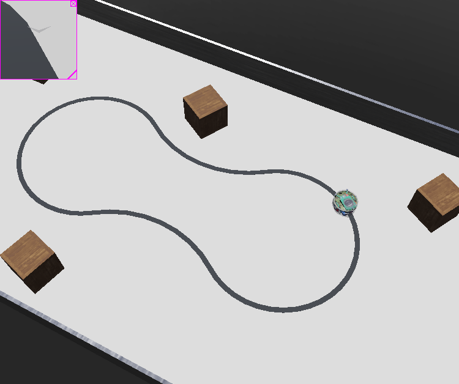

# Epuck Line follower

This project uses webot simulator and the epuck robot to follow a line. The camera sensor is used to do the task.

> [Epuck line follower video](https://webots.cloud/AcTt0P8)

## Credits and useful link

* [Webot line follower with IR ground sensors](https://www.youtube.com/watch?v=D0jhvFZJ5Ok)
* [Tutorial 1: Your First Simulation in Webots](https://cyberbotics.com/doc/guide/tutorial-1-your-first-simulation-in-webots?tab-language=python)
* [Tutorial 4: More about Controllers](https://cyberbotics.com/doc/guide/tutorial-4-more-about-controllers?tab-language=python)
* [GCTronic' e-puck](https://cyberbotics.com/doc/guide/epuck)
* [Download Line Map proto](https://github.com/KajalGada/Youtube-Tutorial-Download-Material)
* [Python Webot reference guide](https://cyberbotics.com/doc/reference/robot?tab-language=python)

